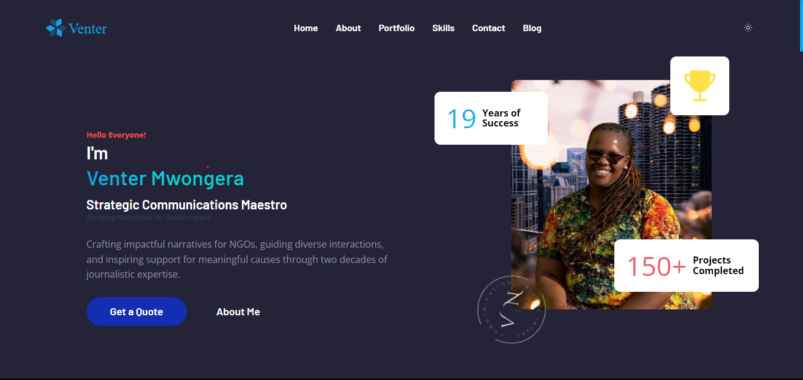
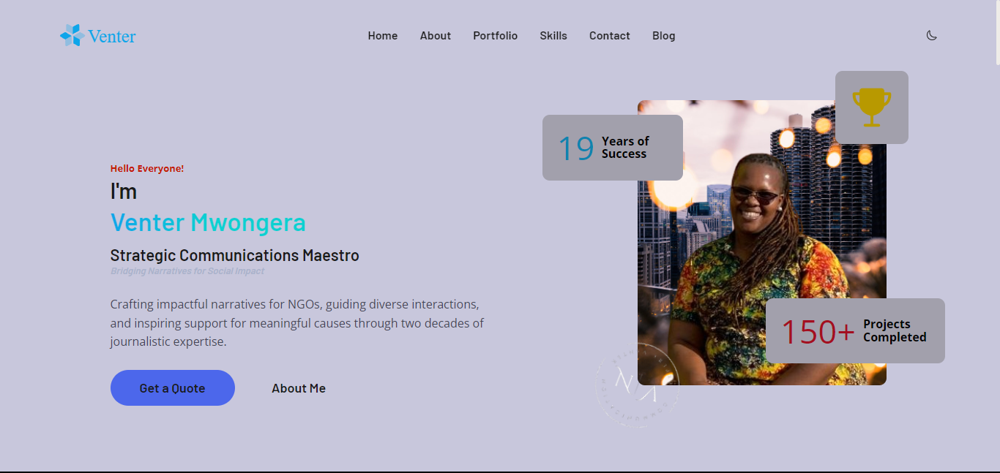

<h2 align="center">Connect with me</h2>

<div align="center">

 &nbsp;
[](https://silasmugambi.pages.dev) &nbsp;
[](https://twitter.com/intent/follow?screen_name=mugambimungiria) &nbsp;
[](https://www.linkedin.com/in/silasmugambi/) &nbsp;
[](https://github.com/mugambi12) &nbsp;
[](https://github.com/venter-mwongera_portfolio/alx-high_level_programming) &nbsp;


</div>

<div align="center">

  <br />
  <br />

  <h2 align="center">Venter Mwongera's Portfolio Website</h2>

Fully responsive personal portfolio website, <br />Responsive for all devices, built using HTML, CSS, and JavaScript by [Silas Mugambi](mailto:mungiria8@mail.com).

<a href="https://mugambi12.github.io/portfolio/"><strong>➥ Live Demo</strong></a>

</div>

<br />

### Demo Screenshots




# Venter Mwongera's Portfolio Website

## Overview

This repository contains the source code for Venter Mwongera's portfolio website. The website showcases Venter's expertise in strategic communications, journalism, and NGO collaboration. It includes sections such as Home, About, Portfolio, Skills, Contact, and Blog.

## Table of Contents

- [Prerequisites](#prerequisites)
- [Run Locally](#run-locally)
- [Usage](#usage)
- [Folder Structure](#folder-structure)
- [Technologies Used](#technologies-used)
- [Features](#features)
- [Contributing](#contributing)
- [Contact](#contact)
- [License](#license)

## Prerequisites

Before you begin, ensure you have met the following requirements:

- [Git](https://git-scm.com/downloads "Download Git") must be installed on your operating system.

## Run Locally

To run **Portfolio** locally, run this command on your git bash:

1. Clone the repository:

   Linux and macOS:

   ```bash
   sudo
   git clone https://github.com/mugambi12/venter-mwongera-portfolio.git
   ```

   Windows:

   ```bash

   git clone https://github.com/mugambi12/venter-mwongera-portfolio.git
   ```

2. Open the project in your preferred code editor.

3. Open the `index.html` file in a web browser to view the website locally.

## Usage

- The website provides an interactive and visually appealing platform to showcase Venter Mwongera's skills, portfolio, and articles.
- Navigation is smooth, and users can explore different sections easily.

## Folder Structure

```plaintext
venter-mwongera-portfolio/
├── assets/
│   ├── css/
│   │   ├── style.css
│   ├── images/
│   │   ├── (various images used in the website)
│   ├── js/
│   │   ├── script.js
│   │   ├── theme_toggle.js
├── index.html
├── README.md
```

## Technologies Used

- HTML
- CSS
- JavaScript
- Swiper.js (for the portfolio carousel)

## Features

1. **Responsive Design:** The website is designed to be responsive and compatible with various devices.

2. **Interactive Portfolio:** The portfolio section includes a swiper carousel for an engaging display of projects.

3. **Contact Form:** Users can easily drop a message through the contact form.

4. **Blog Section:** The website features a blog section where the latest articles can be explored.

## Contributing

If you'd like to contribute to this project, feel free to fork the repository, make your changes, and submit a pull request. Your contributions are welcomed!

## Contact

If you would like to contact me, please feel free to reach out via email at [mungiria8@mail.com](mailto:mungiria8@mail.com).

## License

This project is licensed under the [MIT License](LICENSE).

---
